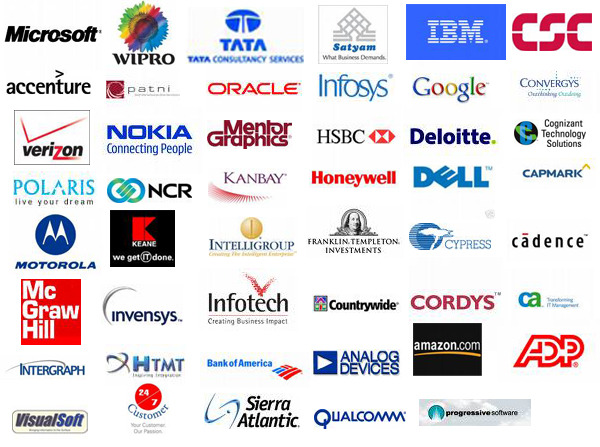
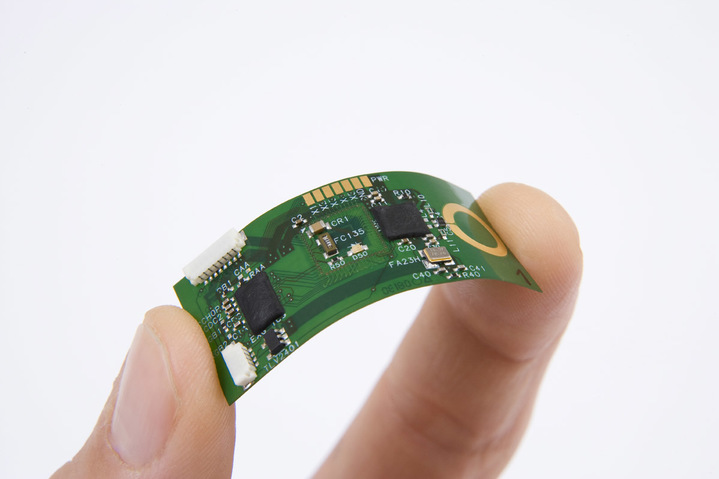
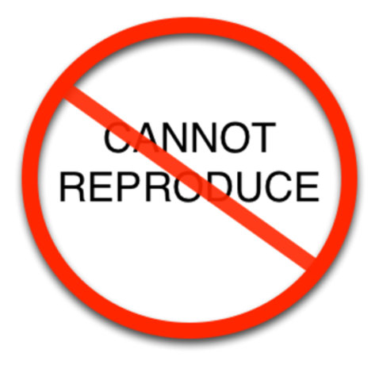
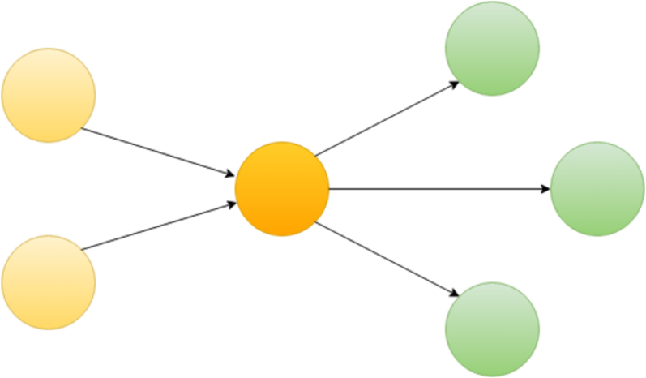
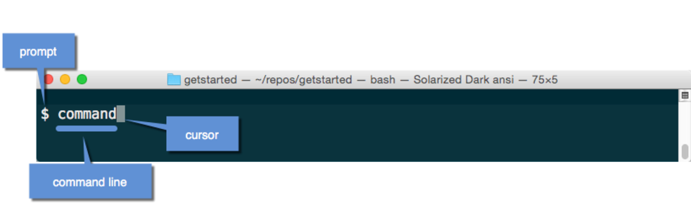

layout: true
background-image: url(images/bg.jpg)
class: center, middle

---

# The Docker Basics

---

# Agenda

1. What is Docker?
2. Reasons
3. Benefits
4. Installation
5. CLI interface
6. GUI?

???

The Notes

---

# What is Docker?


.center[A person employed in a port to load and unload ships]

---

# Are you kidding me?


---

# Gotcha!


---

# How it works?


???

Docker containers wrap up a piece of software in a complete filesystem
that contains everything it needs to run: code, runtime, system tools,
system libraries – anything you can install on a server.

This guarantees that it will always run the same,
regardless of the environment it is running in.

---

# Docker Containers vs Virtual Machine


???

### General

Containers have similar resource isolation and allocation benefits
as virtual machines but a different architectural approach allows
them to be much more portable and efficient.

#### Virtual Machines

Each virtual machine includes the application, the necessary binaries
and libraries and an entire guest operating system -
all of which may be tens of GBs in size.

#### Containers

Containers include the application and all of its dependencies,
but share the kernel with other containers. They run as an isolated process
in userspace on the host operating system. They’re also not tied
to any specific infrastructure – Docker containers run on any computer,
on any infrastructure and in any cloud.

---

# Reasons

1. Learn something new and interest
2. Everybody uses it (CircleCI, Codeship, etc. etc.)
3. To enhance your CV

---

# Docker is Interesting


---

# Everybody Uses It



---

# Even This Guy


---

# Enhance your CV


???

---

# Really?


---


---

# Benefits

1. Lightweight services
2. Flexible DevOps
3. Reproduce unreproducable

---

# Lightweight services


???

### Background story

I had a weak comp before but for now still same habits.

I like when my comp don't load unnecessary things
b/c I can't suppose when exactly I'll need his full power.

I like when I can install some specific software without pain.

---

# Flexible DepOps



???

You want to have n different versions of software product
in same moment without pain? - Docker!

You want to choose one of a few third party service to connect with your? - Docker!

You want to move all stuff you have over here to over there? - Docker!

[Repeat] You want to save some specific OS configuration

---

# Reproduce unreproducible



---

# Installation

0. Add gpg key
1. Set source list
2. Install

---

# Add gpg key

```
# Way 0
wget -qO- https://get.docker.com/gpg | sudo apt-key add -

# Way 1
apt-key adv --keyserver hkp://p80.pool.sks-keyservers.net:80 --recv-keys LOL_KEY
# see actual key on https://docs.docker.com/engine/installation/ubuntulinux/
```

---

# Set source list

```
echo 'deb https://apt.dockerproject.org/repo ubuntu-trusty main' | sudo tee /etc/apt/sources.list.d/docker.list
```

---

# Installation

```
# Way 0
wget -qO- https://get.docker.com/ | sh

# Way 1
sudo apt-get update
sudo apt-get install docker-engine

# Way 2
sudo apt-get install lxc-docker lxc-docker-1.9.1
```
---



---


---


---



---

# CLI interface

---

# GUI

---

# The End

---

# Questions?
