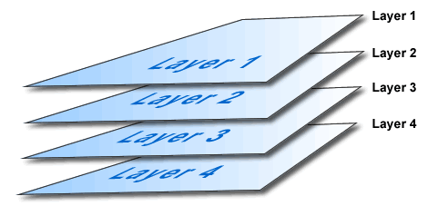
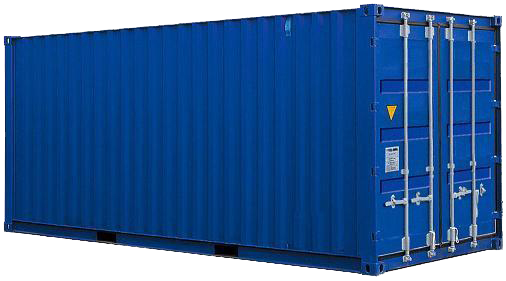

layout: true
background-image: url(images/bg.jpg)
class: center, middle

---


# Don't Be Afraid of Docker

---


# Containerize it!

---

# Agenda

1. What is Docker?
2. Installation
3. Basics
4. Docker Compose
5. Docker in Development
6. Docker in Production

???

WAIT
So, let's start. What is Docker?
NEXT

---

# What is Docker?


A person employed in a port to load and unload ships

???

WAIT

Do you think I'm joking?

NEXT

---

# Are you kidding me?


???

WAIT

No, I'm seriously. At the very beginning of the google search results
you can see it by yourself. But to be honest...

NEXT

---

# Gotcha!


???

Google knows wait I really mean :)

---

# How it works?


???

Explanation from official site:

Docker containers wrap up a piece of software in a complete filesystem
that contains everything it needs to run: code, runtime, system tools,
system libraries – anything you can install on a server.

This guarantees that it will always run the same,
regardless of the environment it is running in.

---

# Docker Containers vs Virtual Machine


???

We will use comparison with VM. Who have ever ever used VMs? I mean
VirtualBox, Vagrant, VMWare, etc. etc. Sorry guys who never ever used it.
Maybe some things will be harder to understand.

NOT READ ALL STUFF BELOW IF NOBODY LIKES FIRST DEFINITION!

One more official definition.

### General

Containers have similar resource isolation and allocation benefits
as virtual machines but a different architectural approach allows
them to be much more portable and efficient.

#### Virtual Machines

Each virtual machine includes the application, the necessary binaries
and libraries and an entire guest operating system -
all of which may be tens of GBs in size.

#### Containers

Containers include the application and all of its dependencies,
but share the kernel with other containers. They run as an isolated process
in userspace on the host operating system. They’re also not tied
to any specific infrastructure – Docker containers run on any computer,
on any infrastructure and in any cloud.

---

# Installation

0. Add gpg key
1. Set source list
2. Install

---

# Add gpg key

```
# Way 0
wget -qO- https://get.docker.com/gpg | sudo apt-key add -

# Way 1
apt-key adv --keyserver hkp://p80.pool.sks-keyservers.net:80 --recv-keys LOL_KEY
# see actual key on https://docs.docker.com/engine/installation/ubuntulinux/
```

---

# Set source list

```
echo 'deb https://apt.dockerproject.org/repo ubuntu-trusty main' | sudo tee /etc/apt/sources.list.d/docker.list
```

---

# Installation

```
# Way 0
wget -qO- https://get.docker.com/ | sh

# Way 1
sudo apt-get install docker-engine

```

---

# A Bit of Theory

???

Many people starts here from images or containers.
But I think Layers should be at first

---

# Layer



???

Let's compare it with virtual machine. We have snapshotes there
for keep things in saved state. If you made changes and want
to save it and reuse or just for backup, you do snapshot of
the whole system. Layers work different. It's just diff between
before and after state. Procs and cons:

+ lightweight cause of just diff
- can't be applied only to parrent layer (no cherry-pick here)

Raw layers are no-sense. For make they reusable we must be sure
they in completed state. Images for that.

---

# Image


???

Image - complited bunch of layers, which contain smth. useful inside.
Can be different types: base, like ubuntu:14.04; and specific mquandalle/wekan
Images have id, name and tag(optional). Also every image have specific
start options: exposed ports, workdir, env varialbes, entrypoint.

---

# Examples

## ubuntu:14.04

## mquandalle/wekan

???

We want to use image functionality in some way. Have no sense without containers. 
B/c it's just bunch of layers with ability to configure before start.
For run actually start we need container abstraction.

---

# Container



???

Writable/executable layer on top of last image layer. It runs OS
with arguments and configuration of image and create separate
environment from host OS. You can think about it like an instance of class.
Class - image. You can run one or a few of instances of same image.
It'll name 'containers'. For example, you wanna training scaling skill.
You just pull postgre image from Docker Hub and run a few containers of
this image. Link it to master and voila - you have 6 years of experience
in scaling big data projects. Awesome? I think it is.

Any question on this section? Maybe let's briefly disscuss it just now,
before start review actual interfaces?

#### Super optional

Btw, now you should understard why drawing docker as delivery of containers
is stupid. You'll deliver not containers, but IMAGES! Damm marketing.

---

# CLI interface


---

# Pretty Basics

```
docker ps [-a]
docker images

docker run [options] IMAGE
docker stop CONTAINER
docker start CONTAINER
docker exec [options] CONTAINER

docker logs
docker inspect

docker rm CONTAINER
docker rmi IMAGE
```

???

## It would be nice if you'll have enough time to show demo here

I'm sure you will not use port forwarding to reduce pain. You'll try
to keep best practices. So you'll find botton spagetti command very useful.
Especially when you'll need to check if recently runned service works.

---

# Dockerfile

TODO: describe dockerfile with examples

---

# GUI

- https://www.docker.com/docker-toolbox
- https://docs.docker.com/mac/started/
- https://docs.docker.com/windows/started/

---

# Also

- Docker Hub. Autobuild

---

# Brief Recap

- Docker bases on layers, images and containers
- Only 10 main command line commands
- Dockerfile is used for builds
- Docker Compose is used for linking project parts
- You can use docker for minor parts but need one more abstraction level for production

---

# The End

---

# Questions?


