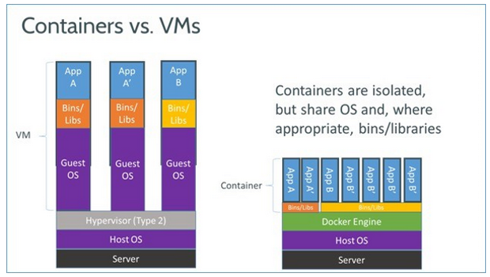
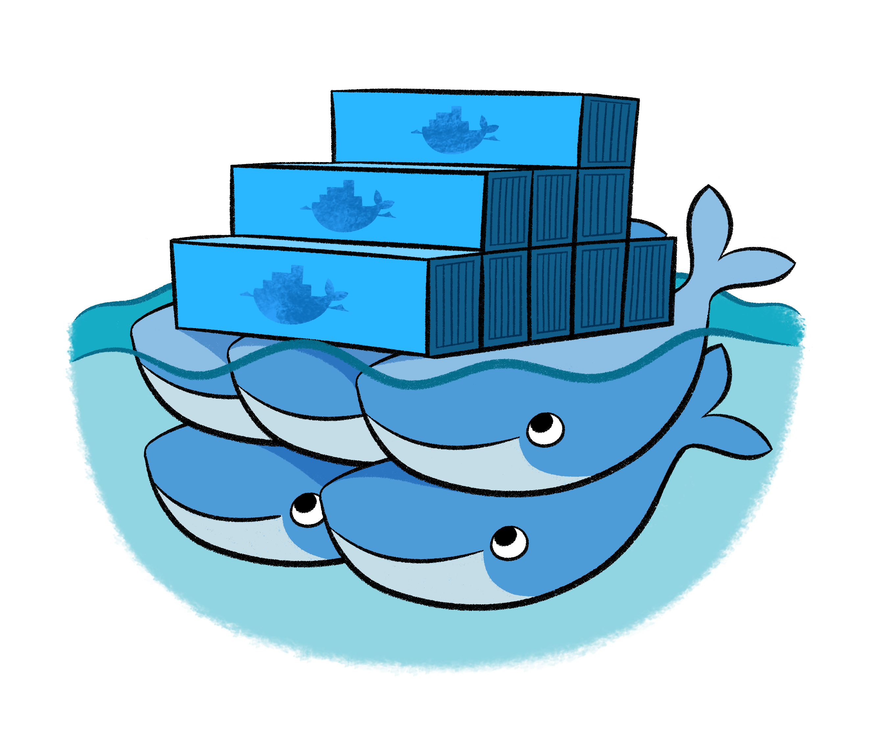

layout: true
background-image: url(images/bg.jpg)
class: center, middle

---


# Don't Be Afraid of Docker

???

Can't choose between two titles. So other available

---


# Containerize it!

---

# About me

@goodniceweb


[Twitter](https://twitter.com/goodniceweb) |
[Facebook](https://www.facebook.com/goodniceweb) |
[GitHub](https://github.com/goodniceweb) |
[LinkedIn](https://www.linkedin.com/in/alexey-cherkashin-08ba41b1)

???

I'm from Ukraine. I work with Ruby and Rails apps 3 years. 5 years in web industry
I'm currently working in ITechArt company.

---

# Agenda

1. What is Docker?
2. Installation
3. Basics
4. Docker Compose
5. Docker in Development
6. Docker in Production

???

WAIT

So, let's start. What is Docker?

NEXT

---

# What is Docker?


A person employed in a port to load and unload ships

???

WAIT

Do you think I'm joking?

NEXT

---

# Are you kidding me?


???

WAIT

No, I'm seriously. At the very beginning of the google search results
you can see it by yourself. But to be honest...

NEXT

---

# Gotcha!


???

Google knows wait I really mean :)

---

# How it works?


???

So lets discuss how it works. There will be a bit of theory.
But at first I wanna ask:

- Who has ever used some kind of virtual machine software
  (VirtualBox, Vagrant, VMWare, etc. etc. )
- Who has ever heard smth about Docker?
- Who has ever used Docker?
- Who uses Docker regular?
- Who uses Docker in Development?
- Who uses Docker in Production?

---

# Docker Containers vs Virtual Machine



???

We will use comparison with VM. Who have ever ever used VMs? I mean
VirtualBox, Vagrant, VMWare, etc. etc. Sorry guys who never ever used it.
Maybe some things will be harder to understand.

---

# Layers, Images and Containers


???

### Layers

Let's compare it with virtual machine. We have snapshotes there
for keep things in saved state. If you made changes and want
to save it and reuse or just for backup, you do snapshot of
the whole system. Layers work different. It's just diff between
before and after state. Procs and cons:

+ lightweight cause of just diff
- can't be applied only to parrent layer (no cherry-pick here)

Raw layers are no-sense. For make they reusable we must be sure
they in completed state. Images for that.

### Images

Image - complited bunch of layers, which contain smth. useful inside.
Can be different types: base, like ubuntu:14.04; and specific mquandalle/wekan
Images have id, name and tag(optional). Also every image have specific
start options: exposed ports, workdir, env varialbes, entrypoint.

### Containers

Writable/executable layer on top of last image layer. It runs OS
with arguments and configuration of image and create separate
environment from host OS. You can think about it like an instance of class.
Class - image. You can run one or a few of instances of same image.
It'll name 'containers'. For example, you wanna training scaling skill.
You just pull postgre image from Docker Hub and run a few containers of
this image. Link it to master and voila - you have 6 years of experience
in scaling big data projects. Awesome? I think it is.

Any question on this section? Maybe let's briefly disscuss it just now,
before start review actual interfaces?

---

# Image Examples

## ubuntu:14.04

## mquandalle/wekan

???

We want to use image functionality in some way. Have no sense without containers. 
B/c it's just bunch of layers with ability to configure before start.
For run actually start we need container abstraction.

---

# Installation

0. Add gpg key
1. Set source list
2. Install

---

# Add gpg key

```
# Way 0
wget -qO- https://get.docker.com/gpg | sudo apt-key add -

# Way 1
apt-key adv --keyserver hkp://p80.pool.sks-keyservers.net:80 --recv-keys LOL_KEY
# see actual key on https://docs.docker.com/engine/installation/ubuntulinux/
```

---

# Set source list

```
echo 'deb https://apt.dockerproject.org/repo ubuntu-trusty main' | sudo tee /etc/apt/sources.list.d/docker.list
```

---

# Installation

```
# Way 0
wget -qO- https://get.docker.com/ | sh

# Way 1
sudo apt-get install docker-engine

```

---

# CLI interface


---

# Pretty Basics

```
docker ps [-a]
docker images

docker run [options] IMAGE
docker stop CONTAINER
docker start CONTAINER
docker exec [options] CONTAINER

docker logs
docker inspect

docker rm CONTAINER
docker rmi IMAGE
```

???

## It would be nice if you'll have enough time to show demo here

I'm sure you will not use port forwarding to reduce pain. You'll try
to keep best practices. So you'll find botton spagetti command very useful.
Especially when you'll need to check if recently runned service works.

---

# Dockerfile


???

A Dockerfile is a text document that contains all the commands
a user could call on the command line to assemble an image.
Using docker build users can create an automated build
that executes several command-line instructions in succession.

---

# Example

```
FROM ruby:2.2.0

RUN apt-get update -qq && apt-get install -y build-essential libpq-dev nodejs

ENV APP_HOME /myapp
RUN mkdir $APP_HOME
WORKDIR $APP_HOME

ADD Gemfile* $APP_HOME/
RUN bundle install

ADD . $APP_HOME
```

???

FROM: This describes the image we’ll be basing our container off of
in this case, we’re using the Ruby 2.2 image.
RUN: This is how we run commands
in this example, RUN is used primarily to install various pieces of software with Apt.
WORKDIR: This defines the base directory from which all our commands are executed.
ADD: This copies files from the host machine
(in our case, relative to Dockerfile) to the container.

And that's it! We're enough with it to successfully... FAIL!
As you can see we installed libpq-dev. And it's not just for fun.
We have pg in Gemfile. We surely can link postgre container but it's not Docker journey

---

# Docker Compose


???

Compose is a tool for defining and running multi-container Docker applications

---

# Docker Compose - Example

```
db:
  image: postgres:9.5.1
  ports:
    - "5432:5432"

web:
  build: .
  command: bin/rails server --port 3003 --binding 0.0.0.0
  ports:
    - "3003:3003"
  links:
    - db
```

???

Please get official postgre image has tag 9.5.1 and run it with exposed port 5432
Then run a `docker build` in current directory as you can see from the `.` arg
After the build, it runs it with `command` and exposed port `3003`

*joke about 3003 port for rubists*

Also it links `db` container to `web` so web can connect to it internally but we don't
Pretty simple.

---

# Usage in Development


???

From the example in previous slide you can see we use posgres 9.5.1 version.
Sometimes people say it unnecessary abstraction level. They just haven't ever
worked on multiple projects where clients use different versions of same software
dependency. It's gorgeous to have such tool when u faced with similar case.

---

# One Service

```
# once
docker run --name es -p 9200:9200 -p 9300:9300 -d elasticsearch
# next time and always
docker start es
```

???

We give short name. Customize port forwarding. Detauch tty

---

# Another Service

```
# once
docker run --name mysql6 -p 3306 -d mysql:5.6
# next time and always
docker start mysql6
```

???

Almost same but tags/version takes a place. Very useful for such cases.

---

# Whole project


???

As I mentioned above I haven't enough time to prepare so cats still here

---

# Usage in Production


???

Simple even then development but to take flexibility you need an abstraction level

- ensure u aren't using root user
- docker itself usually is not enough - See Kubernetes, Swarm, Mesos (Next slide!)

---

<table style="margin: 0 auto;"><tbody><tr>
<td></td>
<td></td>
<tr/><tr>
<td style="text-align: center" colspan=2></td>
</tr></tbody></table>

???

We're ending. There some things behind the scene:

NEXT

---

# Also

- LXC, AUFS
- Docker Hub. Autobuild
- Kubernetes, CoreOS

???

- internals(1)
- contribute to dockerhub(2)
- clusters with docker(3)

You gonna learn them by yourself if you would like.
A tons of stuff in Inet. We just haven't enough time

#### SuperOptional

Also Persistence in Docker is very interest theme
but have no time and no sense to talk about it without
real code examples.

---

# Brief Recap

- Docker bases on layers, images and containers
- Only 10 main command line commands
- Dockerfile is used for builds
- Docker Compose is used for linking project parts
- You can use docker for minor parts but need one more abstraction level for production

---

# Pros

- Lightweight
- Single Environment
- DRY

# Cons

- Still lot of issues
- Require knowledge and DevOps skills
- One more abstraction level

???

### Pros

1. If you're still using Vagrant or smth. like this, try Docker
2. It's cool to have project running via one single command:

```
docker-compose up
```

3. "Measure twice cut once".

### Cons

1. Issues - 1343 (8218 closed)
2. Hard to learn and understand deeply during one or two evenings(like Redux)
3. Abstractions are not always good.
Be careful to use apropriate tools to your needs

---

# The End

---

# Questions?


